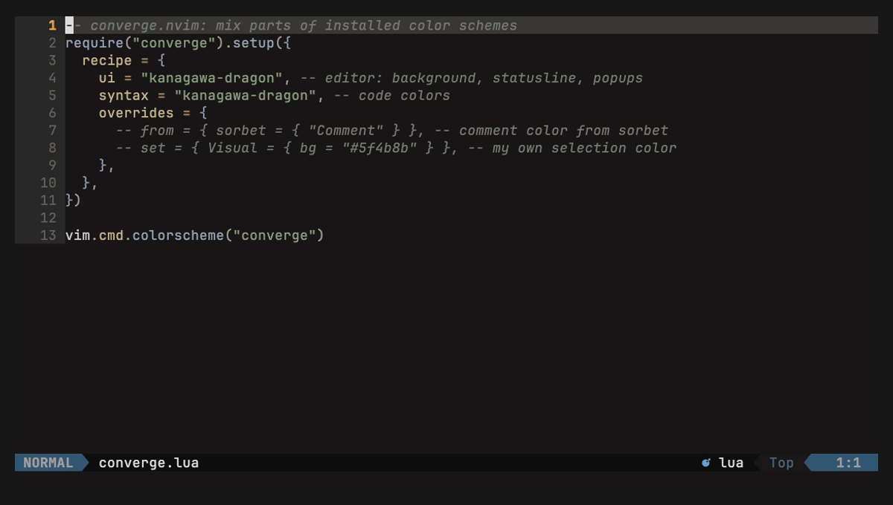
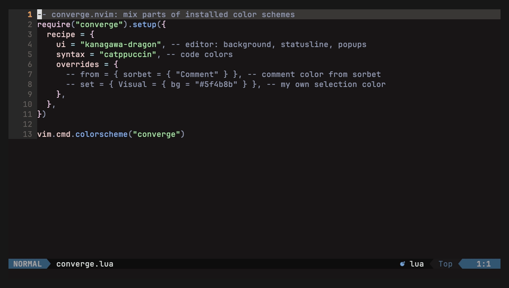
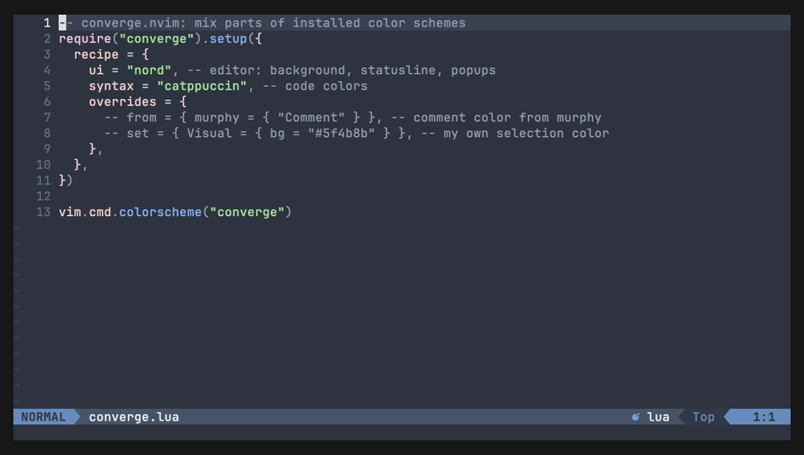
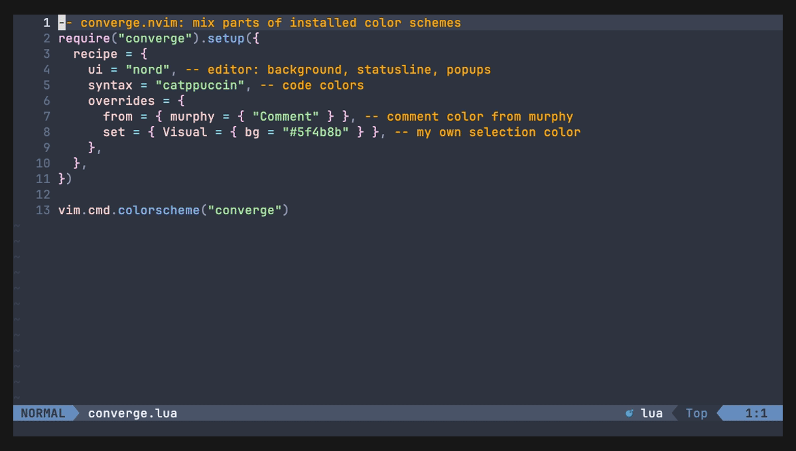

# converge.nvim

Mix parts of installed color schemes into one. Syntax from one theme, editor UI from
another, terminal colors from a third. Pick with a live preview.

Requires Neovim 0.10 or newer. No dependencies.

## Demo

### Take code colors from another theme



### Take the editor UI from another theme



### Change single colors with overrides



### Pick and preview themes live with :Converge



### Your pick survives a restart, :Converge reset goes back to your config


## Install

With [lazy.nvim](https://github.com/folke/lazy.nvim):

```lua
{
  "sunnytamang/converge.nvim",
  lazy = false,
  priority = 1000,
  config = function()
    require("converge").setup({
      recipe = { ui = "tokyonight-night", syntax = "catppuccin-mocha" },
    })
    vim.cmd.colorscheme("converge")
  end,
},
```

Themes in the recipe work even when lazy.nvim loads them lazily: converge loads them with
`:colorscheme`, which lets lazy.nvim load the theme's plugin first. The picker also lists
lazy themes that are not loaded yet.

## Setup

```lua
require("converge").setup({
  recipe = {
    ui = "tokyonight-night",
    syntax = "catppuccin-mocha",
    terminal = "gruvbox",
  },
})
vim.cmd.colorscheme("converge")
```

Slices: `ui`, `syntax`, `diagnostics`, `git`, `terminal`, `plugins`.
A slice you leave out uses the `ui` theme.

## Overrides

Change single highlight groups on top of the slices. Write them in your config:

```lua
recipe = {
  ui = "kanagawa-dragon",
  syntax = "kanagawa",
  overrides = {
    from = {                                 -- take groups from another theme
      nord = { "Comment" },
    },
    set = {                                  -- your own colors (nvim_set_hl format)
      Visual = { bg = "#2d4f67" },
    },
  },
}
```

Order: slices, then `from`, then `set`. If a group is in both, `set` wins.

Groups that link to an overridden group in their theme follow it. In the example,
`@comment` and `@lsp.type.comment` (which link to `Comment` in most themes) get nord's
comment color too. UI groups follow the same way, for example `CursorLineNr -> Comment`.
A group you name yourself always keeps its own override.

Overrides always come from your config, even when you saved a recipe with `s`.
To find a group's name, put the cursor on the text and run `:Inspect`.

Theme or group names with `-`, `.`, or a leading `@` must be written in brackets and quotes,
because Lua would read `kanagawa-dragon = ...` as a subtraction:

```lua
from = {
  ["kanagawa-dragon"] = { "Comment" },   -- not: kanagawa-dragon = { ... }
},
set = {
  ["@string"] = { fg = "#a3be8c" },      -- not: @string = { ... }
},
```

Plain names like `nord` work both ways: `nord = { ... }` and `["nord"] = { ... }` are the same.
Plugins that force their colors in a `ColorScheme` autocmd can win over `set` (as with any color scheme).

## Picker

`:Converge` opens the picker.

| Key | Slice list | Theme list |
|---|---|---|
| `<CR>` | pick a theme for this slice | keep this theme |
| `<Esc>` | close (undo unsaved) | undo, back to slices |
| `s` | save the recipe | |
| `y` | copy the recipe as Lua | |
| `q` | close (undo unsaved) | close (undo unsaved) |

A saved recipe's slices win over the ones in `setup()`; overrides always come from `setup()`.
The `overrides` line in the slice list is read-only (edit overrides in your config).

## Commands

- `:Converge reset` - delete the saved recipe.
- `:Converge refresh` - delete the cache and read all themes again.

## How it works

Each theme is loaded once. Its colors are saved in `stdpath("cache")/converge/`.
The cache refreshes when the theme's files change (everything in the theme's `colors/` and
`lua/` folders). The first time a theme is used (a cold cache), `ColorScheme` fires once for
each theme that is read, and the old colors stay for one moment while that happens.

Theme options (for example a `setup()` call of the theme) are not part of its files. After
changing a theme's options, run `:Converge refresh`.
